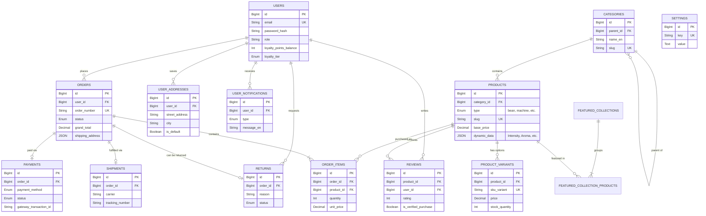

# Entity Relationship Diagram (ERD)

Below is the Mermaid ERD visualizing how the database tables connect to one another.

```mermaid
erDiagram
    USERS ||--o{ ORDERS : "places"
    USERS ||--o{ USER_ADDRESSES : "saves"
    USERS ||--o{ REVIEWS : "writes"
    USERS ||--o{ RETURNS : "requests"
    USERS ||--o{ USER_NOTIFICATIONS : "receives"

    CATEGORIES ||--o{ PRODUCTS : "contains"
    CATEGORIES ||--o{ CATEGORIES : "parent of"

    PRODUCTS ||--o{ PRODUCT_VARIANTS : "has options"
    PRODUCTS ||--o{ REVIEWS : "receives"
    PRODUCTS ||--o{ ORDER_ITEMS : "purchased as"

    ORDERS ||--|{ ORDER_ITEMS : "contains"
    ORDERS ||--o| PAYMENTS : "paid via"
    ORDERS ||--o| SHIPMENTS : "fulfilled via"
    ORDERS ||--o| RETURNS : "can be returned"

    FEATURED_COLLECTIONS ||--|{ FEATURED_COLLECTION_PRODUCTS : "groups"
    PRODUCTS ||--o{ FEATURED_COLLECTION_PRODUCTS : "featured in"

    %% Table Definitions
    USERS {
        BigInt id PK
        String email UK
        String password_hash
        String role
        Int loyalty_points_balance
        Enum loyalty_tier
    }

    USER_ADDRESSES {
        BigInt id PK
        BigInt user_id FK
        String street_address
        String city
        Boolean is_default
    }

    CATEGORIES {
        BigInt id PK
        BigInt parent_id FK
        String name_en
        String slug UK
    }

    PRODUCTS {
        BigInt id PK
        BigInt category_id FK
        Enum type "bean, machine, etc."
        String slug UK
        Decimal base_price
        JSON dynamic_data "Intensity, Aroma, etc."
    }

    PRODUCT_VARIANTS {
        BigInt id PK
        BigInt product_id FK
        String sku_variant UK
        Decimal price
        Int stock_quantity
    }

    ORDERS {
        BigInt id PK
        BigInt user_id FK
        String order_number UK
        Enum status
        Decimal grand_total
        JSON shipping_address
    }

    ORDER_ITEMS {
        BigInt id PK
        BigInt order_id FK
        BigInt product_id FK
        Int quantity
        Decimal unit_price
    }

    PAYMENTS {
        BigInt id PK
        BigInt order_id FK
        Enum payment_method
        Enum status
        String gateway_transaction_id
    }

    SHIPMENTS {
        BigInt id PK
        BigInt order_id FK
        String carrier
        String tracking_number
    }

    RETURNS {
        BigInt id PK
        BigInt order_id FK
        String reason
        Enum status
    }

    REVIEWS {
        BigInt id PK
        BigInt product_id FK
        BigInt user_id FK
        Int rating
        Boolean is_verified_purchase
    }

    SETTINGS {
        BigInt id PK
        String key UK
        Text value
    }

    USER_NOTIFICATIONS {
        BigInt id PK
        BigInt user_id FK
        Enum type
        String message_en
    }
```
