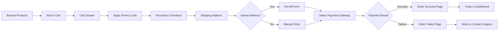
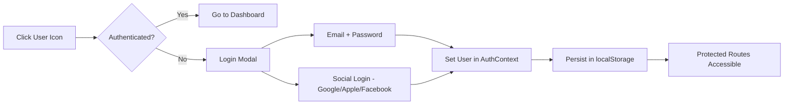

# Cafrezzo — Webapp Documentation

> **Stack:** Next.js 16 (Turbopack) · React 19 · Framer Motion · Lucide Icons · TypeScript  
> **Styling:** Tailwind CSS + custom design tokens (`sb-green`, `sb-black`, `sb-white`, `font-display`)

---

## 1. Architecture Overview

```
src/
├── app/                    # Next.js App Router pages
│   ├── layout.tsx          # Root layout (all providers + Header/Footer)
│   ├── page.tsx            # Homepage
│   ├── shop/               # Product listing + product detail
│   ├── machines/           # Machines category
│   ├── accessories/        # Accessories category
│   ├── sweets/             # Gourmandises / Treats category
│   ├── checkout/           # Multi-step checkout
│   ├── order-success/      # Post-payment success
│   ├── order-failed/       # Post-payment failure
│   ├── account/            # User dashboard (orders, addresses, profile)
│   ├── wishlist/           # Saved products
│   ├── loyalty/            # Café Rewards stub
│   ├── returns/            # Return/refund request stub
│   ├── notifications/      # Full notification list
│   ├── blog/               # Journal / articles
│   ├── contact/            # Contact + store locator
│   ├── brew-guide/         # Brewing guide
│   ├── faq/                # FAQ
│   ├── terms/              # Terms & conditions
│   ├── privacy/            # Privacy policy
│   ├── shipping/           # Shipping info
│   ├── visit-shop/         # Visit our shop
│   └── wholesale/          # Wholesale page
├── components/
│   ├── layout/             # Header, Footer, PromoStrip
│   └── ui/                 # ProductCard, ProductDetailPanel, CartDrawer, etc.
├── context/                # React Context providers
├── store/                  # CartContext
├── lib/                    # Config, product data, translations
├── hooks/                  # Custom hooks (useDragScroll)
└── types/                  # TypeScript interfaces
```

---

## 2. Context Providers

All providers wrap the app in `layout.tsx`:

| Context | File | Purpose |
|---------|------|---------|
| **ThemeProvider** | `ThemeContext.tsx` | Dark/light mode toggle, persisted in localStorage |
| **AuthProvider** | `AuthContext.tsx` | User session, login/logout, address CRUD, mock order management |
| **LanguageProvider** | `LanguageContext.tsx` | FR/EN language toggle with 80+ translation keys |
| **CartProvider** | `CartContext.tsx` | Cart items, promo codes, free-shipping threshold, discount logic |
| **WishlistProvider** | `WishlistContext.tsx` | Product wishlist with add/remove/toggle, localStorage |
| **NotificationsProvider** | `NotificationsContext.tsx` | Demo notifications, unread count, mark read |

---

## 3. Pages & Features

### 3.1 Homepage (`/`)
- Animated hero with CTA
- Featured Products carousel
- Featured Machines section with "View All" CTA
- Heritage/brand story section
- Customer testimonials
- Newsletter CTA

### 3.2 Shop (`/shop`)
- Full product grid with category filter tabs
- Advanced filter drawer (Category, Intensity range, Price, Tags, In-Stock)
- ProductCard → Side Panel → "Full Experience" PDP flow
- Sort options, search integration

### 3.3 Product Detail (`/shop/[slug]`)
- Hero image gallery with thumbnails
- Sticky purchase column (unit selector, quantity, add to cart)
- Taste profile bars (Acidity, Body, Bitterness, Sweetness)
- Features accordion
- Customer reviews section with star ratings
- Related products grid

### 3.4 Category Pages (`/machines`, `/accessories`, `/sweets`)
- Category-specific hero with tagline
- Tag-based sub-filtering
- Shared ProductCard + ProductDetailPanel components
- Perks strip (eco-friendly, compatibility, bulk savings)

### 3.5 Checkout (`/checkout`)
- **Step 1 — Shipping:** Pre-fill from saved default address or fill manually
- **Step 2 — Payment:** 4 redirect-based gateway options:
  - Stripe (Credit/Debit)
  - Wise (Bank Transfer)
  - Apple Pay / Google Pay
  - Cash on Delivery
- **Step 3 — Review:** Full order summary with promo code, shipping calculation
- **No card fields stored** — all payments redirect to external gateways
- Real-time order summary sidebar

### 3.6 Order Success (`/order-success`)
- Confetti animation on load
- Full order details (ID, date, items, payment method, shipping address)
- "Track Order" and "Continue Shopping" CTAs

### 3.7 Order Failed (`/order-failed`)
- Reason-specific messaging (declined, gateway error, timeout, cancelled)
- "Cart saved" and "No charge" reassurance cards
- Retry payment and Contact Support CTAs

### 3.8 Account Dashboard (`/account`)
Protected route — redirects to login if unauthenticated.

**3 Tab Layout:**
- **Orders:** Paginated (4/page), expandable detail cards, status badges (Processing/Shipped/Delivered/Cancelled), tracking timeline, "Write Review" for delivered items
- **Addresses:** Full CRUD — add, edit, delete, set default; modal form with validation
- **Profile:** View/edit name + email, avatar photo upload (file input + preview), save with success toast, member stats (total orders, member since)

### 3.9 Wishlist (`/wishlist`)
- Grid of wishlisted products with remove + "Add to Cart" buttons
- Empty state with CTA to browse shop
- "Clear wishlist" action

### 3.10 Loyalty (`/loyalty`) — Stub
- Café Rewards points balance card with gradient tier styling
- 4 tiers: Espresso → Café → Grand Crème → Barista Elite
- Progress bar to next tier
- Mock points history (earn/redeem/bonus)
- "Coming Soon" banner

### 3.11 Returns (`/returns`) — Stub
- 4-step flow: Select Order → Details → Review → Confirmed
- Order ID input, reason dropdown, description textarea
- Refund method choice (Original Payment or Store Credit +10% bonus)
- Confirmation with reference number
- Return policy section

### 3.12 Notifications (`/notifications`)
- Full notification list with type icons (Order/Promo/System)
- Unread indicator dots
- Mark individual or all as read
- "View →" links to relevant pages

### 3.13 Blog (`/blog`)
- Article listing with featured image + excerpt
- Individual article pages (`/blog/[slug]`)
- Category tags, reading time

### 3.14 Contact (`/contact`)
- Contact info strip (Address, Phone, Email, Hours)
- Embedded Google Maps iframe
- Contact form (First Name, Last Name, Email, Subject, Message)
- FAQ accordion section
- Business info (SIRET, TVA)

### 3.15 Other Pages
| Page | Route | Content |
|------|-------|---------|
| Brew Guide | `/brew-guide` | Step-by-step coffee brewing guides |
| FAQ | `/faq` | Frequently asked questions accordion |
| Terms | `/terms` | Terms and conditions |
| Privacy | `/privacy` | Privacy policy |
| Shipping | `/shipping` | Shipping information |
| Visit Shop | `/visit-shop` | Physical store info |
| Wholesale | `/wholesale` | B2B ordering info |

---

## 4. Header Features

- **Navigation:** Two-row layout — promo strip + main nav with category links
- **Search:** Global search overlay with live product filtering and category shortcuts
- **Language Toggle:** FR/EN dropdown with flag emojis, localStorage persistence
- **Dark Mode:** Moon/Sun toggle icon connected to ThemeContext
- **Wishlist:** Heart icon with count badge, links to `/wishlist`
- **Notifications:** Bell icon with unread count; dropdown with full notification list, mark read
- **User Menu:** "Hi, {firstName}" greeting when authenticated; click → dashboard or login modal
- **Cart:** Shopping bag icon with item count; opens Cart Drawer sidebar

---

## 5. Cart & Checkout Flow



---

## 6. Authentication Flow



---

## 7. Component Library

| Component | File | Purpose |
|-----------|------|---------|
| `ProductCard` | `ui/ProductCard.tsx` | Product grid card — hover gallery, quick-add, discount badges |
| `ProductDetailPanel` | `ui/ProductDetailPanel.tsx` | Side panel overlay with product details |
| `CartDrawer` | `ui/CartDrawer.tsx` | Slide-out cart sidebar |
| `FilterDrawer` | `ui/FilterDrawer.tsx` | Advanced filter sidebar for shop pages |
| `LoginModal` | `ui/LoginModal.tsx` | Login/register modal with social login |
| `ReviewModal` | `ui/ReviewModal.tsx` | Star rating + text review modal |
| `ProtectedRoute` | `ui/ProtectedRoute.tsx` | Auth guard wrapper component |
| `IntensityBar` | `ui/IntensityBar.tsx` | Visual intensity indicator |
| `Header` | `layout/Header.tsx` | Main navigation + search + icons |
| `Footer` | `layout/Footer.tsx` | Links, newsletter, branding |
| `PromoStrip` | `layout/PromoStrip.tsx` | Top announcement banner |

---

## 8. Data Layer

- **Products:** `lib/productsData.ts` — enriched product catalog with full metadata (slug, images, taste profiles, sale units, reviews, specs)
- **Config:** `lib/config.ts` — brand settings, social links, support links, promo settings
- **Translations:** `context/LanguageContext.tsx` — 80+ keys for FR/EN
- **Types:** `types/index.ts` — `Product`, `User`, `Order`, `Address`, `CartItem`, `OrderItem`, `SaleUnit`

---

## 9. Deployment Notes

- **Static Export:** Configured for `output: 'export'` — all pages pre-rendered
- **Dynamic Routes:** `generateStaticParams()` for `/shop/[slug]` and `/blog/[slug]`
- **Hosting:** Netlify-ready with `_redirects` for SPA fallback
- **No Backend Required:** All data is client-side mock data; ready for API integration
